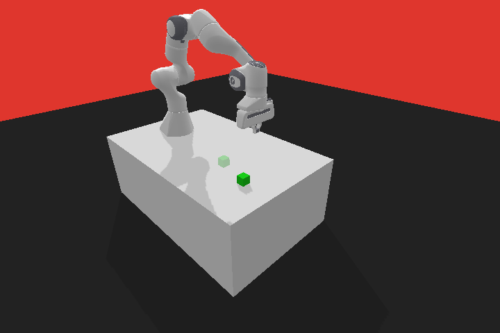

# Reinforcement Learning

## Robotic



### Pre-requisites

- Python 3.9 (e.g. [Python 3.9.5](https://www.python.org/downloads/release/python-395/) was used)
- A virtual environment (e.g. [virtualenv](https://pypi.org/project/virtualenv/) venv)

### Setup

```
pip install -U virtualenv
virtualenv venv
source venv/bin/activate
pip install -r requirements.txt
```

### Run

```
jupyter notebook
```

### Monitor

```
tensorboard --logdir=logs/tensorboard/
```

### Resources

- #### Environment

  - [OpenAI Gym](https://github.com/openai/gym)
  - [Panda-gymp](https://github.com/qgallouedec/panda-gym)
  - [Pybullet](https://github.com/bulletphysics/bullet3)

- #### Reinforcement Learning

  - [Stable-Baselines3](https://github.com/DLR-RM/stable-baselines3)
  - [Stable-Baselines3 - Contrib](https://github.com/Stable-Baselines-Team/stable-baselines3-contrib)
  - [Reinforcement Learning Baselines3 Zoo](https://github.com/DLR-RM/rl-baselines3-zoo)
  - [Reinforcement Learning Baselines3 HER](https://stable-baselines3.readthedocs.io/en/master/modules/her.html)

- #### Image
  - [Imageio](https://github.com/imageio/imageio)
