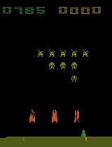

# Reinforcement Learning

## Space Invaders



### Pre-requisites

- Python 3.9 (e.g. [Python 3.9.12](https://www.python.org/downloads/release/python-3912/) was used)
- A virtual environment (e.g. [virtualenv](https://pypi.org/project/virtualenv/) venv)

### Setup

```
pip install -U virtualenv
virtualenv venv
source venv/bin/activate
pip install -r requirements
```

### Run

```
jupyter notebook
```

### Monitor

```
tensorboard --logdir=logs/tensorboard/
```

### Resources

- #### Environment

  - [OpenAI Gym](https://github.com/openai/gym)
  - [Arcade Learning Environment](https://github.com/mgbellemare/Arcade-Learning-Environment)
  - [AutoROM](https://github.com/Farama-Foundation/AutoROM)

- #### Reinforcement Learning

  - [Stable-Baselines3](https://github.com/DLR-RM/stable-baselines3)
  - [Stable-Baselines3 - Contrib](https://github.com/Stable-Baselines-Team/stable-baselines3-contrib)
  - [Reinforcement Learning Baselines3 Zoo](https://github.com/DLR-RM/rl-baselines3-zoo)

- #### Image

  - [Pyglet](https://github.com/pyglet/pyglet)
  - [Imageio](https://github.com/imageio/imageio)
